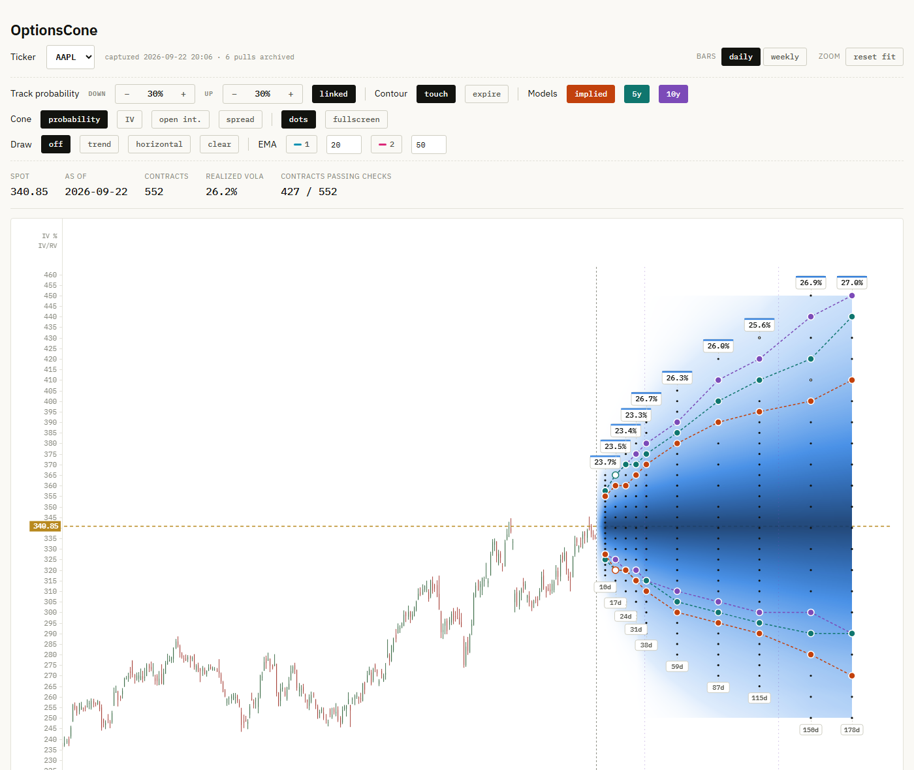

# OptionsCone

How likely is a stock to touch a given price before a given date? OptionsCone
answers that for every listed option contract of a ticker, and draws the
answer as a cone on the price chart.



Each dot is a listed contract. The colour behind it is the probability that
the price touches that strike before that expiry. The contour lines follow a
chosen probability (30% by default) through the expiries, once for each of
three models:

- **implied**: from the option prices themselves, with each contract's own
  implied volatility
- **5y** and **10y**: a block bootstrap of the stock's own daily history over
  the last five or ten years

Where the market and the stock's history disagree, the lines separate.

The cone can also be coloured by implied volatility, open interest or bid-ask
spread. Hovering a contract shows its probabilities, quote, delta and gamma. A
data table lists the values for the whole chain, and the Methods section in the
app explains every number.

## Download

Windows: download `OptionsCone.exe` from the
[Releases](https://github.com/nikkn/OptionsCone/releases) page and run it. No
installation is needed.

The executable is not code-signed, so Windows SmartScreen may warn on the first
start. Click **More info**, then **Run anyway**.

## Use

Type a ticker (for example `AAPL`) and press **download**. The first download
of a ticker takes a minute or two: the option chain is fetched, every contract
is priced on a binomial tree, and 10,000 bootstrap paths are simulated per
model. **refresh all** downloads a fresh chain for every ticker already held.

Every download is archived on your computer, so a history of option chains
builds up over time. **data folder** opens it; the packaged app keeps its data
in `%LOCALAPPDATA%\OptionsCone`.

Option quotes are only meaningful while the US market is open. Outside trading
hours the app uses the newest download taken during the session.

Chart controls: drag to pan, Ctrl or Shift + scroll wheel to zoom, **reset**
to return to the full view. F toggles fullscreen.

## Run from source

Python 3.11 or later.

```
python -m venv venv
venv\Scripts\activate
pip install -r requirements.txt
python app.py
```

Run from source, all data is written into the project folder. Set
`OPTIONSCONE_HOME` to put it elsewhere.

`python app.py --selftest AAPL` runs the whole pipeline once without a window
and writes the result to the log.

## Build the executable

```
pip install -r requirements.txt -r requirements-build.txt
python build_exe.py
```

The result is `dist/OptionsCone.exe`. Build in a clean virtual environment:
PyInstaller bundles everything installed, so a crowded environment makes the
executable several times larger. The build also writes
`THIRD_PARTY_LICENSES.txt` with the licenses of all bundled libraries.

PyInstaller does not cross-compile. A macOS build has to be made on a Mac and
has not been tested.

## Project layout

```
app.py                  desktop window, download pipeline, progress
build_exe.py            packaging
charts/export_data.py   probabilities, bootstrap and per-ticker data files
charts/build_chart.py   the chart page (HTML, CSS and JavaScript in one file)
src/american.py         binomial tree, implied volatility, Greeks
src/barrier.py          closed-form touch probabilities
src/montecarlo.py       block bootstrap with daily highs and lows
src/chain.py            option chain download and pricing
src/quality.py          quote quality checks
src/varswap.py          model-free implied volatility per expiry
src/archive.py          storage of every downloaded chain
```

[DESIGN.md](DESIGN.md) explains the main modelling and engineering decisions.

## Data

Market data comes from Yahoo Finance through the
[yfinance](https://github.com/ranaroussi/yfinance) library and is fetched
directly by your computer. OptionsCone is not affiliated with or endorsed by
Yahoo. Yahoo's data is intended for personal use; check its terms before using
it for anything else. Quotes are delayed and can be incomplete or wrong. The
quality checks catch much of that, not all of it.

## Disclaimer

All probabilities are estimates, derived from option prices or from past
returns. They are not forecasts and not financial advice. Use at your own risk.

## License

Copyright (C) 2026 Nikolai Alexander

OptionsCone is free software under the
[GNU Affero General Public License v3.0](LICENSE) or later. You may use, study,
modify and share it. If you distribute a modified version, or offer it to
others over a network, you must publish its source code under the same
license.
